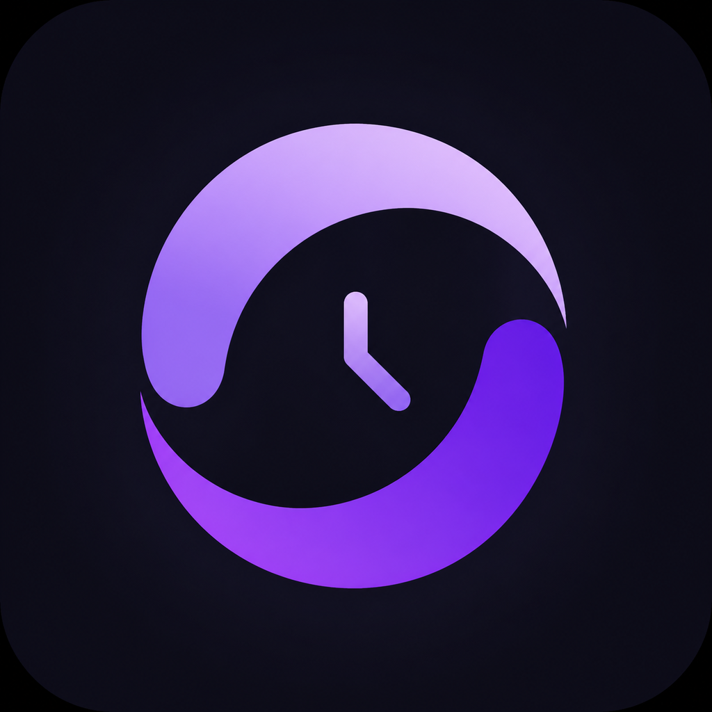

# Timeflow

<p align="center">
  
</p>

<p align="center">
  A calm, minimalist stopwatch built with Rust and Dioxus 0.7.
</p>

Timeflow provides a distraction-free `HH:MM:SS` timer with simple controls and a responsive interface designed for web, desktop, and mobile.

## Features

- Start, pause, and reset controls
- Hours, minutes, and seconds display
- Responsive layout for phones and larger screens
- Accessible elapsed-time labels and keyboard focus states
- Shared Rust codebase across supported Dioxus platforms
- Custom browser and application icons

## Built with

- [Rust](https://www.rust-lang.org/)
- [Dioxus 0.7](https://dioxuslabs.com/learn/0.7/)
- Tokio's asynchronous timer

## Getting started

Install Rust and the Dioxus CLI, then clone the repository and enter its directory.

```sh
cargo install dioxus-cli
```

Run the web version:

```sh
dx serve --web
```

Run the desktop version:

```sh
dx serve --desktop
```

Run on an available iOS Simulator:

```sh
dx serve --ios
```

iOS development requires full Xcode, an installed iOS Simulator runtime, and a booted simulator.

## Useful checks

```sh
cargo fmt --check
cargo check
cargo clippy
```

## Project structure

```text
.
├── assets/          # Styles and application icons
├── src/main.rs      # Stopwatch state, timer task, and interface
├── Cargo.toml       # Rust dependencies and platform features
└── Dioxus.toml      # Dioxus application and bundle metadata
```
